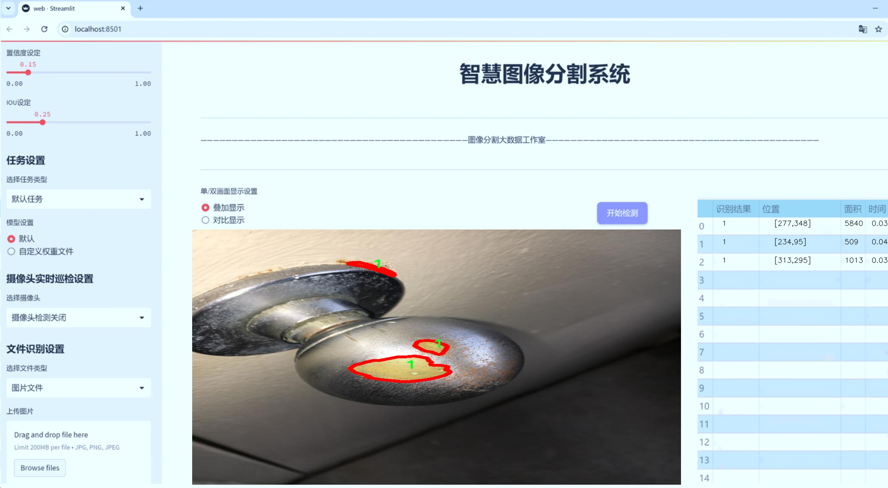
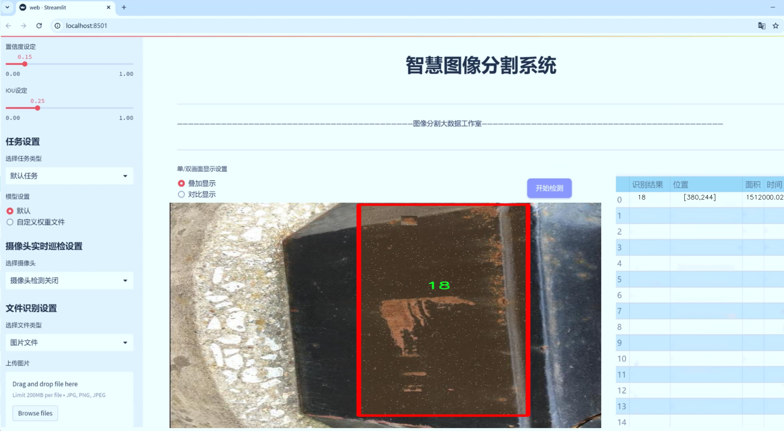
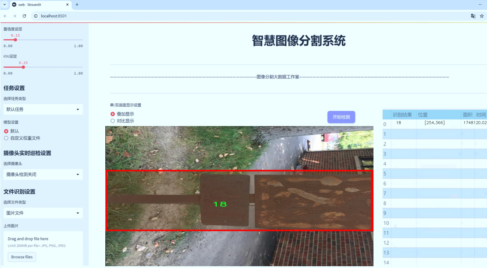
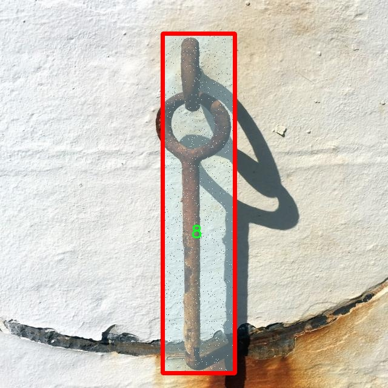
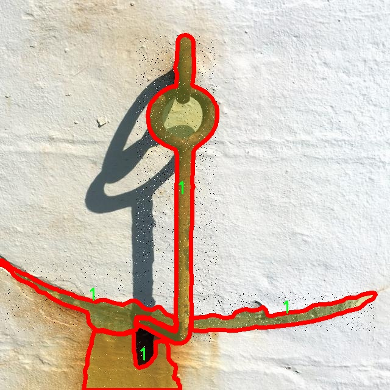
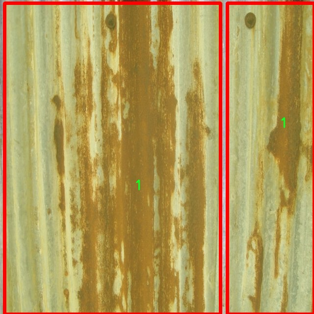
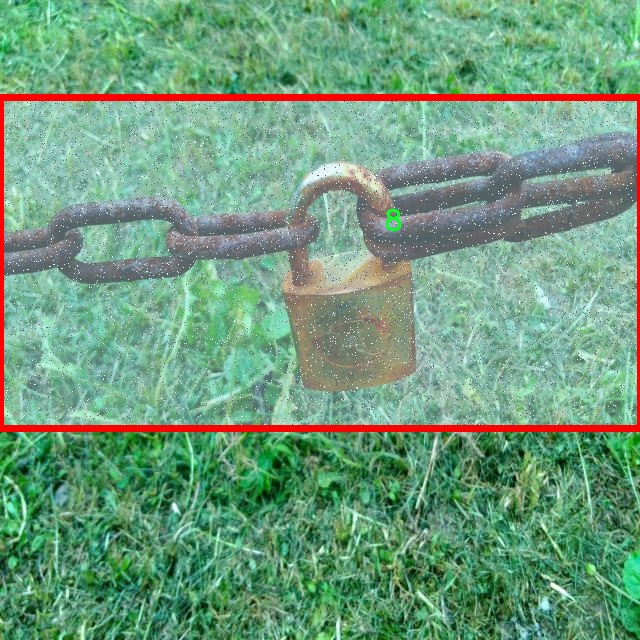

# 金属腐蚀检测分割系统源码＆数据集分享
 [yolov8-seg-C2f-REPVGGOREPA＆yolov8-seg-swintransformer等50+全套改进创新点发刊_一键训练教程_Web前端展示]

### 1.研究背景与意义

项目参考[ILSVRC ImageNet Large Scale Visual Recognition Challenge](https://gitee.com/YOLOv8_YOLOv11_Segmentation_Studio/projects)

项目来源[AAAI Global Al lnnovation Contest](https://kdocs.cn/l/cszuIiCKVNis)

研究背景与意义

金属腐蚀是工业生产和基础设施维护中一个普遍且严重的问题，直接影响到设备的安全性、可靠性和使用寿命。随着工业化进程的加快，金属材料的广泛应用使得腐蚀问题愈发突出，尤其是在石油、化工、电力等高风险行业，腐蚀引发的事故和损失屡见不鲜。因此，及时、准确地检测和评估金属腐蚀的程度，对于预防事故、降低维修成本以及延长设备使用寿命具有重要意义。

传统的金属腐蚀检测方法主要依赖人工检查和传统的无损检测技术，这些方法不仅耗时耗力，而且容易受到人为因素的影响，导致检测结果的准确性和一致性不足。近年来，随着计算机视觉和深度学习技术的迅猛发展，基于图像处理的自动化检测方法逐渐成为研究热点。尤其是实例分割技术的进步，使得在复杂背景下对腐蚀区域的精确定位和识别成为可能。YOLO（You Only Look Once）系列模型因其高效的实时检测能力，广泛应用于物体检测和分割任务中，成为研究者们关注的焦点。

本研究旨在基于改进的YOLOv8模型，构建一个高效的金属腐蚀检测分割系统。我们将利用一个包含9200张图像和20个类别的腐蚀检测数据集，进行模型训练和验证。该数据集的丰富性和多样性为模型的泛化能力提供了良好的基础，能够有效应对不同类型和程度的金属腐蚀情况。通过对YOLOv8模型的改进，我们期望提升其在金属腐蚀检测中的准确性和效率，使其能够在实际应用中发挥更大的作用。

此外，金属腐蚀检测的自动化和智能化不仅能够提高检测效率，降低人工成本，还能为后续的维护决策提供科学依据。通过建立准确的腐蚀检测模型，企业可以实现对设备状态的实时监控，及时发现潜在的腐蚀问题，从而采取预防措施，减少因腐蚀引发的事故和损失。这对于提升设备的安全性和可靠性，保障生产的连续性具有重要的现实意义。

综上所述，基于改进YOLOv8的金属腐蚀检测分割系统的研究，不仅具有重要的理论价值，还具备广泛的应用前景。通过将深度学习技术与金属腐蚀检测相结合，我们希望能够推动该领域的技术进步，为工业界提供更加高效、智能的解决方案。随着研究的深入，期待本系统能够在实际应用中展现出其优越性，为金属腐蚀的监测与管理提供强有力的技术支持。

### 2.图片演示







##### 注意：由于此博客编辑较早，上面“2.图片演示”和“3.视频演示”展示的系统图片或者视频可能为老版本，新版本在老版本的基础上升级如下：（实际效果以升级的新版本为准）

  （1）适配了YOLOV8的“目标检测”模型和“实例分割”模型，通过加载相应的权重（.pt）文件即可自适应加载模型。

  （2）支持“图片识别”、“视频识别”、“摄像头实时识别”三种识别模式。

  （3）支持“图片识别”、“视频识别”、“摄像头实时识别”三种识别结果保存导出，解决手动导出（容易卡顿出现爆内存）存在的问题，识别完自动保存结果并导出到tempDir中。

  （4）支持Web前端系统中的标题、背景图等自定义修改，后面提供修改教程。

  另外本项目提供训练的数据集和训练教程,暂不提供权重文件（best.pt）,需要您按照教程进行训练后实现图片演示和Web前端界面演示的效果。

### 3.视频演示

[3.1 视频演示](https://www.bilibili.com/video/BV18b2tYDEpN/)

### 4.数据集信息展示

##### 4.1 本项目数据集详细数据（类别数＆类别名）

nc: 20
names: ['1', '10', '11', '12', '13', '14', '14 0 0 0 1 1 1 1 0 0 0', '15', '16', '17', '18', '19', '2', '3', '4', '5', '6', '7', '8', '9']


##### 4.2 本项目数据集信息介绍

数据集信息展示

在现代工业环境中，金属腐蚀的检测与预防至关重要，尤其是在航空航天、汽车制造和建筑等领域。为此，我们构建了一个名为“Corrosion Detection”的数据集，旨在为改进YOLOv8-seg的金属腐蚀检测分割系统提供强有力的支持。该数据集包含20个类别，涵盖了多种金属腐蚀的形态与特征，旨在提高模型在实际应用中的准确性和鲁棒性。

数据集中的类别包括从简单的腐蚀形式到复杂的腐蚀模式，具体类别列表为：'1', '10', '11', '12', '13', '14', '14 0 0 0 1 1 1 1 0 0 0', '15', '16', '17', '18', '19', '2', '3', '4', '5', '6', '7', '8', '9'。这些类别的命名方式反映了不同腐蚀程度和类型的细微差别。例如，类别'1'可能代表轻微的表面腐蚀，而类别'19'则可能指代严重的深层腐蚀。这种细致的分类不仅有助于模型的训练，也为后续的腐蚀评估提供了更为精确的依据。

在数据集的构建过程中，我们采集了大量的图像数据，涵盖了不同环境、不同金属材料以及不同腐蚀状态下的样本。这些图像经过精心标注，确保每个类别的样本都能真实反映其特征。为了增强模型的泛化能力，我们还对图像进行了多种数据增强处理，包括旋转、缩放、亮度调整等，以模拟实际应用中可能遇到的各种情况。

“Corrosion Detection”数据集的设计目标是使得YOLOv8-seg模型能够在各种复杂环境中高效、准确地识别和分割金属腐蚀区域。通过引入多样化的样本和细致的类别划分，我们希望模型不仅能够识别出腐蚀的存在，还能对其严重程度进行评估，从而为后续的维护和修复工作提供重要依据。

此外，数据集的可用性和开放性也是我们关注的重点。我们计划将该数据集分享给相关研究人员和工业界，以促进金属腐蚀检测技术的发展。通过集体的努力，我们相信可以推动这一领域的进步，提高金属结构的安全性和可靠性。

总之，“Corrosion Detection”数据集不仅是一个用于训练YOLOv8-seg模型的工具，更是推动金属腐蚀检测技术进步的重要资源。我们期待通过这一数据集的应用，能够在金属腐蚀检测领域取得突破性进展，为各行各业的安全生产提供有力保障。










### 5.全套项目环境部署视频教程（零基础手把手教学）

[5.1 环境部署教程链接（零基础手把手教学）](https://www.bilibili.com/video/BV1jG4Ve4E9t/?vd_source=bc9aec86d164b67a7004b996143742dc)


[5.2 安装Python虚拟环境创建和依赖库安装视频教程链接（零基础手把手教学）](https://www.bilibili.com/video/BV1nA4VeYEze/?vd_source=bc9aec86d164b67a7004b996143742dc)

### 6.手把手YOLOV8-seg训练视频教程（零基础小白有手就能学会）

[6.1 手把手YOLOV8-seg训练视频教程（零基础小白有手就能学会）](https://www.bilibili.com/video/BV1cA4VeYETe/?vd_source=bc9aec86d164b67a7004b996143742dc)


按照上面的训练视频教程链接加载项目提供的数据集，运行train.py即可开始训练



     Epoch   gpu_mem       box       obj       cls    labels  img_size
     1/200     0G   0.01576   0.01955  0.007536        22      1280: 100%|██████████| 849/849 [14:42<00:00,  1.04s/it]
               Class     Images     Labels          P          R     mAP@.5 mAP@.5:.95: 100%|██████████| 213/213 [01:14<00:00,  2.87it/s]
                 all       3395      17314      0.994      0.957      0.0957      0.0843

     Epoch   gpu_mem       box       obj       cls    labels  img_size
     2/200     0G   0.01578   0.01923  0.007006        22      1280: 100%|██████████| 849/849 [14:44<00:00,  1.04s/it]
               Class     Images     Labels          P          R     mAP@.5 mAP@.5:.95: 100%|██████████| 213/213 [01:12<00:00,  2.95it/s]
                 all       3395      17314      0.996      0.956      0.0957      0.0845

     Epoch   gpu_mem       box       obj       cls    labels  img_size
     3/200     0G   0.01561    0.0191  0.006895        27      1280: 100%|██████████| 849/849 [10:56<00:00,  1.29it/s]
               Class     Images     Labels          P          R     mAP@.5 mAP@.5:.95: 100%|███████   | 187/213 [00:52<00:00,  4.04it/s]
                 all       3395      17314      0.996      0.957      0.0957      0.0845


### 7.50+种全套YOLOV8-seg创新点代码加载调参视频教程（一键加载写好的改进模型的配置文件）

[7.1 50+种全套YOLOV8-seg创新点代码加载调参视频教程（一键加载写好的改进模型的配置文件）](https://www.bilibili.com/video/BV1Hw4VePEXv/?vd_source=bc9aec86d164b67a7004b996143742dc)

### 8.YOLOV8-seg图像分割算法原理

原始YOLOv8-seg算法原理

YOLOv8-seg是2023年由Ultralytics公司推出的YOLO系列的最新版本，它在YOLOv7的基础上进行了深度优化，标志着目标检测和分割技术的又一次飞跃。YOLOv8-seg不仅继承了YOLO系列的高效性和准确性，还在多个方面进行了创新，尤其是在图像分割任务的处理上，展现了其强大的能力。

YOLOv8-seg的核心思想是将目标检测与图像分割任务有效结合，通过引入分割头来实现对目标的精确分割。这一方法的优势在于，传统的目标检测算法往往只能提供目标的边界框，而YOLOv8-seg则能够提供更为细致的目标形状信息，极大地提高了在复杂场景下的识别能力。这种细粒度的分割能力使得YOLOv8-seg在智能监控、自动驾驶、医学影像分析等领域具有广泛的应用前景。

在网络结构方面，YOLOv8-seg依然采用了经典的主干网络（backbone）、特征增强网络（neck）和检测头（head）三部分的设计。主干网络继续使用CSP（Cross Stage Partial）结构，这种结构能够有效减小模型的计算量，同时保持较高的特征提取能力。特征增强网络则引入了PAN-FPN（Path Aggregation Network - Feature Pyramid Network）的思想，通过多层次特征的融合，进一步提升了模型对不同尺度目标的检测能力。PAN-FPN的设计使得YOLOv8-seg能够在多尺度的特征图上进行信息的整合，增强了模型对小目标和大目标的识别能力。

YOLOv8-seg的检测头采用了解耦的设计，这一创新使得分类和回归任务能够独立进行，从而减少了任务之间的干扰。具体而言，模型将目标的分类和定位分为两个独立的分支，这样可以使得每个分支都能够更加专注于自身的任务，显著提高了检测的准确性。在处理复杂场景时，这种解耦设计尤其有效，能够有效减少因任务耦合导致的错误。

在目标检测的具体实现上，YOLOv8-seg采用了Anchor-free的目标检测方法。这一方法的核心在于，模型不再依赖于预先定义的锚框，而是通过回归的方式直接预测目标的位置和大小。这种设计的优势在于，传统的锚框选择和调整过程往往繁琐且不够灵活，而YOLOv8-seg通过直接预测，使得模型能够更快地聚焦于目标位置的邻近点，从而提高了预测框的准确性。这一特性使得YOLOv8-seg在处理不同尺度和形状的目标时，表现出更强的适应性。

YOLOv8-seg还引入了多尺度训练和测试的策略，通过在不同尺度下对模型进行训练，使得模型能够在多种场景下保持高效的检测性能。这种多尺度策略不仅提升了模型的鲁棒性，还有效增强了其在不同应用场景中的适用性。

此外，YOLOv8-seg在模型的轻量化方面也做出了重要的贡献。与之前的YOLO版本相比，YOLOv8-seg的权重文件得到了进一步的压缩，这使得模型能够在嵌入式设备上高效运行，满足实时检测的需求。这一特性使得YOLOv8-seg能够广泛应用于边缘计算设备，推动了智能监控、无人驾驶等领域的技术进步。

在实验结果方面，YOLOv8-seg在多个公开数据集上均取得了优异的表现。与传统的目标检测算法相比，YOLOv8-seg在精度（mAP）和帧率上均有显著提升，尤其是在复杂场景下，其表现尤为突出。这一结果表明，YOLOv8-seg不仅在理论上具有优势，在实际应用中也展现了其强大的能力。

综上所述，YOLOv8-seg作为YOLO系列的最新版本，通过深度优化和创新设计，在目标检测和图像分割任务中展现了卓越的性能。其独特的网络结构、解耦的检测头、Anchor-free的目标检测方法以及多尺度训练策略，使得YOLOv8-seg在各种应用场景中都能够提供高效、准确的检测结果。随着YOLOv8-seg的不断发展和应用，其在智能监控、自动驾驶等领域的潜力将进一步被挖掘，为相关技术的进步提供新的动力。


### 9.系统功能展示（检测对象为举例，实际内容以本项目数据集为准）

图9.1.系统支持检测结果表格显示

  图9.2.系统支持置信度和IOU阈值手动调节

  图9.3.系统支持自定义加载权重文件best.pt(需要你通过步骤5中训练获得)

  图9.4.系统支持摄像头实时识别

  图9.5.系统支持图片识别

  图9.6.系统支持视频识别

  图9.7.系统支持识别结果文件自动保存

  图9.8.系统支持Excel导出检测结果数据


### 10.50+种全套YOLOV8-seg创新点原理讲解（非科班也可以轻松写刊发刊，V11版本正在科研待更新）

#### 10.1 由于篇幅限制，每个创新点的具体原理讲解就不一一展开，具体见下列网址中的创新点对应子项目的技术原理博客网址【Blog】：


[10.1 50+种全套YOLOV8-seg创新点原理讲解链接](https://gitee.com/qunmasj/good)

#### 10.2 部分改进模块原理讲解(完整的改进原理见上图和技术博客链接)【如果此小节的图加载失败可以通过CSDN或者Github搜索该博客的标题访问原始博客，原始博客图片显示正常】
### YOLOv8简介

YOLOv8是一种最新的SOTA算法，提供了N/S/M/L/X尺度的不同大小模型，以满足不同场景的需求。本章对算法网络的新特性进行简要介绍。


1）骨干网络和Neck
开发者设计了C2f模块对CSPDarkNet 53和PAFPN进行改造。相比C3模块，C2f模块拥有更多的分支跨层链接，使模型的梯度流更加丰富，显著增强了模型的特征提取能力。
2)Head部分
Head部分采用无锚框设计，将分类任务和回归任务进行了解耦，独立的分支将更加专注于其所负责的特征信息。
3）损失计算
模型使用CIOU Loss作为误差损失函数，并通过最小化DFL进一步提升边界框的回归精度。同时模型采用了TaskAlignedAssigner样本分配策略，以分类得分和IOU的高阶组合作为指标指导正负样本选择，实现了高分类得分和高IOU的对齐，有效地提升了模型的检测精度。


### D-LKA Attention简介
自2010年代中期以来，卷积神经网络（CNNs）已成为许多计算机视觉应用的首选技术。它们能够从原始数据中自动提取复杂的特征表示，无需手动进行特征工程，这引起了医学图像分析社区的极大兴趣。许多成功的CNN架构，如U-Net、全卷积网络、DeepLab或SegCaps（分割胶囊），已经被开发出来。这些架构在语义分割任务中取得了巨大成功，先前的最新方法已经被超越。

在计算机视觉研究中，不同尺度下的目标识别是一个关键问题。在CNN中，可检测目标的大小与相应网络层的感受野尺寸密切相关。如果一个目标扩展到超出这个感受野的边界，这可能会导致欠分割结果。相反，与目标实际大小相比使用过大的感受野可能会限制识别，因为背景信息可能会对预测产生不必要的影响。

解决这个问题的一个有希望的方法涉及在并行使用具有不同尺寸的多个Kernel，类似于Inception块的机制。然而，由于参数和计算要求的指数增长，将Kernel大小增加以容纳更大的目标在实践中受到限制。因此，出现了各种策略，包括金字塔池化技术和不同尺度的扩张卷积，以捕获多尺度的上下文信息。

另一个直观的概念涉及将多尺度图像金字塔或它们的相关特征表示直接纳入网络架构。然而，这种方法存在挑战，特别是在管理训练和推理时间方面的可行性方面存在挑战。在这个背景下，使用编码器-解码器网络，如U-Net，已被证明是有利的。这样的网络在较浅的层中编码外观和位置，而在更深的层中，通过神经元的更广泛的感受野捕获更高的语义信息和上下文信息。

一些方法将来自不同层的特征组合在一起，或者预测来自不同尺寸的层的特征以使用多尺度的信息。此外，出现了从不同尺度的层中预测特征的方法，有效地实现了跨多个尺度的见解整合。然而，大多数编码器-解码器结构面临一个挑战：它们经常无法在不同尺度之间保持一致的特征，并主要使用最后一个解码器层生成分割结果。

语义分割是一项任务，涉及根据预定义的标签集为图像中的每个像素预测语义类别。这项任务要求提取高级特征同时保留初始的空间分辨率。CNNs非常适合捕获局部细节和低级信息，尽管以忽略全局上下文为代价。视觉Transformer（ViT）架构已经成为解决处理全局信息的视觉任务的关键，包括语义分割，取得了显著的成功。

ViT的基础是注意力机制，它有助于在整个输入序列上聚合信息。这种能力使网络能够合并远程的上下文提示，超越了CNN的有限感受野尺寸。然而，这种策略通常会限制ViT有效建模局部信息的能力。这种局限可能会妨碍它们检测局部纹理的能力，这对于各种诊断和预测任务至关重要。这种缺乏局部表示可以归因于ViT模型处理图像的特定方式。

ViT模型将图像分成一系列Patch，并使用自注意力机制来模拟它们之间的依赖关系。这种方法可能不如CNN模型中的卷积操作对感受野内提取局部特征有效。ViT和CNN模型之间的这种图像处理方法的差异可能解释了CNN模型在局部特征提取方面表现出色的原因。

近年来，已经开发出创新性方法来解决Transformer模型内部局部纹理不足的问题。其中一种方法是通过互补方法将CNN和ViT特征结合起来，以结合它们的优势并减轻局部表示的不足。TransUNet是这种方法的早期示例，它在CNN的瓶颈中集成了Transformer层，以模拟局部和全局依赖关系。HiFormer提出了一种解决方案，将Swin Transformer模块和基于CNN的编码器结合起来，生成两个多尺度特征表示，通过Double-Level Fusion模块集成。UNETR使用基于Transformer的编码器和CNN解码器进行3D医学图像分割。CoTr和TransBTS通过Transformer在低分辨率阶段增强分割性能，将CNN编码器和解码器连接在一起。

增强局部特征表示的另一种策略是重新设计纯Transformer模型内部的自注意力机制。在这方面，Swin-Unet在U形结构中集成了一个具有线性计算复杂性的Swin Transformer块作为多尺度 Backbone 。MISSFormer采用高效Transformer来解决视觉Transformer中的参数问题，通过在输入块上进行不可逆的降采样操作。D-Former引入了一个纯Transformer的管道，具有双重注意模块，以分段的方式捕获细粒度的局部注意和与多元单元的交互。然而，仍然存在一些特定的限制，包括计算效率低下，如TransUNet模型所示，对CNN Backbone 的严重依赖，如HiFormer所观察到的，以及对多尺度信息的忽略。

此外，目前的分割架构通常采用逐层处理3D输入 volumetric 的方法，无意中忽视了相邻切片之间的潜在相关性。这一疏忽限制了对 volumetric 信息的全面利用，因此损害了定位精度和上下文集成。此外，必须认识到，医学领域的病变通常在形状上发生变形。因此，用于医学图像分析的任何学习算法都必须具备捕捉和理解这些变形的能力。与此同时，该算法应保持计算效率，以便处理3D volumetric数据。

为了解决上述提到的挑战，作者提出了一个解决方案，即可变形大卷积核注意力模块（Deformable LKA module），它是作者网络设计的基本构建模块。这个模块明确设计成在有效处理上下文信息的同时保留局部描述符。作者的架构在这两个方面的平衡增强了实现精确语义分割的能力。

值得注意的是，参考该博客引入了一种基于数据的感受野的动态适应，不同于传统卷积操作中的固定滤波器Mask。这种自适应方法使作者能够克服与静态方法相关的固有限制。这种创新方法还扩展到了D-LKA Net架构的2D和3D版本的开发。

在3D模型的情况下，D-LKA机制被量身定制以适应3D环境，从而实现在不同 volumetric 切片之间无缝信息交互。最后，作者的贡献通过其计算效率得到进一步强调。作者通过仅依靠D-LKA概念的设计来实现这一点，在各种分割基准上取得了显著的性能，确立了作者的方法作为一种新的SOTA方法。

在本节中，作者首先概述方法论。首先，作者回顾了由Guo等人引入的大卷积核注意力（Large Kernel Attention，LKA）的概念。然后，作者介绍了作者对可变形LKA模块的创新探索。在此基础上，作者介绍了用于分割任务的2D和3D网络架构。

大卷积核提供了与自注意力机制类似的感受野。可以通过使用深度卷积、深度可扩展卷积和卷积来构建大卷积核，从而减少了参数和计算量。构建输入维度为和通道数的卷积核的深度卷积和深度可扩展卷积的卷积核大小的方程如下：


具有卷积核大小和膨胀率。参数数量和浮点运算（FLOPs）的计算如下：


FLOPs的数量与输入图像的大小成线性增长。参数的数量随通道数和卷积核大小的增加而呈二次增长。然而，由于它们通常都很小，因此它们不是限制因素。

为了最小化对于固定卷积核大小K的参数数量，可以将方程3对于膨胀率的导数设定为零：


例如，当卷积核大小为时，结果是。将这些公式扩展到3D情况是直接的。对于大小为和通道数C的输入，3D情况下参数数量和FLOPs 的方程如下：


具有卷积核大小和膨胀。


利用大卷积核进行医学图像分割的概念通过引入可变形卷积得以扩展。可变形卷积可以通过整数偏移自由调整采样网格以进行自由变形。额外的卷积层从特征图中学习出变形，从而创建一个偏移场。基于特征本身学习变形会导致自适应卷积核。这种灵活的卷积核形状可以提高病变或器官变形的表示，从而增强了目标边界的定义。

负责计算偏移的卷积层遵循其相应卷积层的卷积核大小和膨胀。双线性插值用于计算不在图像网格上的偏移的像素值。如图2所示，D-LKA模块可以表示为：


其中输入特征由表示，。表示为注意力图，其中每个值表示相应特征的相对重要性。运算符  表示逐元素乘法运算。值得注意的是，LKA不同于传统的注意力方法，它不需要额外的规范化函数，如或。这些规范化函数往往忽视高频信息，从而降低了基于自注意力的方法的性能。

在该方法的2D版本中，卷积层被可变形卷积所替代，因为可变形卷积能够改善对具有不规则形状和大小的目标的捕捉能力。这些目标在医学图像数据中常常出现，因此这种增强尤为重要。

然而，将可变形LKA的概念扩展到3D领域会带来一定的挑战。主要的约束来自于需要用于生成偏移的额外卷积层。与2D情况不同，由于输入和输出通道的性质，这一层无法以深度可分的方式执行。在3D环境中，输入通道对应于特征，而输出通道扩展到，其中是卷积核的大小。大卷积核的复杂性导致沿第3D的通道数扩展，导致参数和FLOPs大幅增加。因此，针对3D情况采用了另一种替代方法。在现有的LKA框架中，深度卷积之后引入了一个单独的可变形卷积层。这种战略性的设计调整旨在减轻扩展到3D领域所带来的挑战。


2D网络的架构如图1所示。第一变种使用MaxViT作为编码器组件，用于高效特征提取，而第二变种则结合可变形LKA层进行更精细、卓越的分割。

在更正式的描述中，编码器生成4个分层输出表示。首先，卷积干扰将输入图像的维度减小到。随后，通过4个MaxViT块的4个阶段进行特征提取，每个阶段后跟随降采样层。随着过程进展到解码器，实施了4个阶段的D-LKA层，每个阶段包含2个D-LKA块。然后，应用Patch扩展层以实现分辨率上采样，同时减小通道维度。最后，线性层负责生成最终的输出。

2D D-LKA块的结构包括LayerNorm、可变形LKA和多层感知器（MLP）。积分残差连接确保了有效的特征传播，即使在更深层也是如此。这个安排可以用数学方式表示为：


其中输入特征，层归一化LN，可变形LKA注意力，深度卷积，线性层和GeLU激活函数。

3D网络架构如图1所示，采用编码器-解码器设计进行分层结构化。首先，一个Patch嵌入层将输入图像的维度从（）减小到（）。在编码器中，采用了3个D-LKA阶段的序列，每个阶段包含3个D-LKA块。在每个阶段之后，通过降采样步骤将空间分辨率减半，同时将通道维度加倍。中央瓶颈包括另一组2个D-LKA块。解码器结构与编码器相对称。

为了将特征分辨率加倍，同时减少通道数，使用转置卷积。每个解码器阶段都使用3个D-LKA块来促进远距离特征依赖性。最终的分割输出由一个卷积层产生，后面跟随一个卷积层以匹配特定类别的通道要求。

为了建立输入图像和分割输出之间的直接连接，使用卷积形成了一个跳跃连接。额外的跳跃连接根据简单的加法对来自其他阶段的特征进行融合。最终的分割图是通过和卷积层的组合产生的。

3D D-LKA块包括层归一化，后跟D-LKA注意力，应用了残差连接的部分。随后的部分采用了一个卷积层，后面跟随一个卷积层，两者都伴随着残差连接。这个整个过程可以总结如下：


带有输入特征 、层归一化 、可变形 LKA 、卷积层 和输出特征 的公式。是指一个前馈网络，包括2个卷积层和激活函数。

表7显示了普通卷积和构建卷积的参数数量比较。尽管标准卷积的参数数量在通道数较多时急剧增加，但分解卷积的参数总体较低，并且增长速度不那么快。

与分解卷积相比，可变形分解卷积增加了大量参数，但仍然明显小于标准卷积。可变形卷积的主要参数是由偏移网络创建的。在这里，作者假设可变形深度卷积的Kernel大小为（5,5），可变形深度空洞卷积的Kernel大小为（7,7）。这导致了21×21大小的大Kernel的最佳参数数量。更高效地生成偏移量的方法将大大减少参数数量。


值得注意的是，引入可变形LKA确实会增加模型的参数数量和每秒的浮点运算次数（FLOPS）。然而，重要的是强调，这增加的计算负载不会影响作者模型的整体推理速度。

相反，对于Batch-size > 1，作者甚至观察到推理时间的减少，如图7所示。例如，基于作者的广泛实验，作者观察到对于Batch-size为16，具有可变形卷积和没有可变形卷积的推理时间分别为8.01毫秒和17.38毫秒。作者认为这是由于在2D中对可变形卷积的高效实现所致。为了测量时间，使用了大小为（）的随机输入。在GPU热身周期50次迭代之后，网络被推断了1000次。测量是在NVIDIA RTX 3090 GPU上进行的。


为了充分利用性能与参数之间的权衡关系，作者在图8中可视化了在Synapse 2D数据集上报告的DSC和HD性能以及基于参数数量的内存消耗。D-LKA Net引入了相当多的参数，约为101M。这比性能第二好的方法ScaleFormer使用的111.6M参数要少。

与更轻量级的DAEFormer模型相比，作者实现了更好的性能，这证明了参数增加的合理性。大多数参数来自于MaxViT编码器；因此，将编码器替换为更高效的编码器可以减少模型参数。值得注意的是，在此可视化中，作者最初将HD和内存值都归一化到[0, 100]范围内。随后，作者将它们从100缩小，以增强更高值的表示。


### 11.项目核心源码讲解（再也不用担心看不懂代码逻辑）

#### 11.1 ui.py

以下是代码的核心部分，并附上详细的中文注释：

```python
import sys
import subprocess

def run_script(script_path):
    """
    使用当前 Python 环境运行指定的脚本。

    Args:
        script_path (str): 要运行的脚本路径

    Returns:
        None
    """
    # 获取当前 Python 解释器的路径
    python_path = sys.executable

    # 构建运行命令，使用 streamlit 运行指定的脚本
    command = f'"{python_path}" -m streamlit run "{script_path}"'

    # 执行命令
    result = subprocess.run(command, shell=True)
    # 检查命令执行的返回码，如果不为0，表示执行出错
    if result.returncode != 0:
        print("脚本运行出错。")

# 实例化并运行应用
if __name__ == "__main__":
    # 指定要运行的脚本路径
    script_path = "web.py"  # 这里可以直接使用相对路径

    # 调用函数运行脚本
    run_script(script_path)
```

### 代码说明：
1. **导入模块**：
   - `sys`：用于访问与 Python 解释器相关的变量和函数。
   - `subprocess`：用于执行外部命令。

2. **`run_script` 函数**：
   - 接受一个参数 `script_path`，表示要运行的 Python 脚本的路径。
   - 使用 `sys.executable` 获取当前 Python 解释器的路径，以确保使用相同的环境来运行脚本。
   - 构建一个命令字符串，使用 `streamlit` 模块运行指定的脚本。
   - 使用 `subprocess.run` 执行命令，并检查返回码以判断脚本是否成功运行。

3. **主程序块**：
   - 在 `__main__` 中指定要运行的脚本路径（这里为 `web.py`）。
   - 调用 `run_script` 函数来执行指定的脚本。

这个程序文件 `ui.py` 的主要功能是运行一个指定的 Python 脚本，具体来说是通过 Streamlit 框架来启动一个 Web 应用。程序的结构相对简单，主要包含了几个重要的部分。

首先，文件导入了一些必要的模块，包括 `sys`、`os` 和 `subprocess`。其中，`sys` 模块用于访问与 Python 解释器相关的变量和函数，`os` 模块提供了与操作系统交互的功能，而 `subprocess` 模块则用于创建新进程、连接到它们的输入/输出/错误管道，并获取它们的返回码。

接下来，文件中定义了一个名为 `run_script` 的函数，该函数接受一个参数 `script_path`，表示要运行的脚本的路径。在函数内部，首先获取当前 Python 解释器的路径，存储在 `python_path` 变量中。然后，构建一个命令字符串，该命令使用当前的 Python 解释器来运行指定的脚本，命令格式为 `"{python_path}" -m streamlit run "{script_path}"`。接着，使用 `subprocess.run` 方法执行这个命令，并通过 `shell=True` 参数在一个新的 shell 中运行它。函数会检查命令的返回码，如果返回码不为 0，表示脚本运行出错，程序会打印出相应的错误信息。

最后，在文件的主程序部分，通过 `if __name__ == "__main__":` 判断当前模块是否是主程序。如果是，程序会调用 `abs_path` 函数来获取 `web.py` 脚本的绝对路径，并将其存储在 `script_path` 变量中。随后，调用 `run_script` 函数来运行这个脚本。

总体来看，这个文件的主要目的是为了方便地启动一个 Streamlit Web 应用，用户只需指定脚本路径，程序就会处理其余的工作。

#### 11.2 ultralytics\nn\extra_modules\ops_dcnv3\setup.py

以下是经过简化和注释的核心代码部分：

```python
# 导入必要的库
import os
import glob
import torch
from torch.utils.cpp_extension import CUDA_HOME, CppExtension, CUDAExtension
from setuptools import find_packages, setup

# 定义所需的依赖库
requirements = ["torch", "torchvision"]

def get_extensions():
    # 获取当前文件的目录
    this_dir = os.path.dirname(os.path.abspath(__file__))
    # 定义扩展源代码的目录
    extensions_dir = os.path.join(this_dir, "src")

    # 获取主文件和CPU/CUDA源文件
    main_file = glob.glob(os.path.join(extensions_dir, "*.cpp"))
    source_cpu = glob.glob(os.path.join(extensions_dir, "cpu", "*.cpp"))
    source_cuda = glob.glob(os.path.join(extensions_dir, "cuda", "*.cu"))

    # 初始化源文件列表
    sources = main_file + source_cpu
    extension = CppExtension  # 默认使用 CppExtension
    extra_compile_args = {"cxx": []}  # 编译参数
    define_macros = []  # 宏定义

    # 检查CUDA是否可用
    if torch.cuda.is_available() and CUDA_HOME is not None:
        extension = CUDAExtension  # 使用 CUDAExtension
        sources += source_cuda  # 添加CUDA源文件
        define_macros += [("WITH_CUDA", None)]  # 定义宏
        extra_compile_args["nvcc"] = []  # CUDA编译参数
    else:
        raise NotImplementedError('Cuda is not available')  # 抛出异常

    # 构建完整的源文件路径
    sources = [os.path.join(extensions_dir, s) for s in sources]
    include_dirs = [extensions_dir]  # 包含目录

    # 创建扩展模块
    ext_modules = [
        extension(
            "DCNv3",  # 模块名称
            sources,  # 源文件
            include_dirs=include_dirs,  # 包含目录
            define_macros=define_macros,  # 宏定义
            extra_compile_args=extra_compile_args,  # 编译参数
        )
    ]
    return ext_modules  # 返回扩展模块列表

# 设置包信息并调用setup函数
setup(
    name="DCNv3",  # 包名称
    version="1.1",  # 版本号
    author="InternImage",  # 作者
    url="https://github.com/OpenGVLab/InternImage",  # 项目链接
    description="PyTorch Wrapper for CUDA Functions of DCNv3",  # 描述
    packages=find_packages(exclude=("configs", "tests")),  # 查找包，排除configs和tests
    ext_modules=get_extensions(),  # 获取扩展模块
    cmdclass={"build_ext": torch.utils.cpp_extension.BuildExtension},  # 指定构建扩展的命令类
)
```

### 代码说明：
1. **导入库**：导入必要的库，包括`os`、`glob`、`torch`以及`setuptools`中的相关模块。
2. **定义依赖**：列出所需的Python库。
3. **获取扩展函数**：`get_extensions`函数用于查找源文件并构建扩展模块。
   - 检查CUDA是否可用，决定使用CPU或CUDA扩展。
   - 收集源文件路径并设置编译参数。
4. **设置包信息**：使用`setup`函数定义包的元数据，包括名称、版本、作者、描述等信息，并调用`get_extensions`获取扩展模块。

这个程序文件是一个Python的`setup.py`脚本，主要用于构建和安装一个名为“DCNv3”的扩展模块，该模块是为PyTorch提供的CUDA函数的封装。文件的开头包含版权信息和许可证声明，表明该代码属于OpenGVLab并遵循MIT许可证。

在文件中，首先导入了一些必要的模块，包括`os`、`glob`、`torch`以及PyTorch的C++扩展工具。接着，定义了一个`requirements`列表，列出了该模块所依赖的Python包，这里包括`torch`和`torchvision`。

`get_extensions`函数是该脚本的核心部分。它的作用是查找并准备C++和CUDA源文件，以便编译扩展模块。函数首先获取当前文件的目录，并构建源文件的路径。通过`glob`模块，函数查找指定目录下的所有C++和CUDA源文件，并将它们分别存储在`main_file`、`source_cpu`和`source_cuda`变量中。

接下来，函数将主文件和CPU源文件合并到`sources`列表中，并初始化扩展类型为`CppExtension`。如果系统支持CUDA且CUDA_HOME环境变量已设置，函数将扩展类型更改为`CUDAExtension`，并将CUDA源文件添加到`sources`列表中。同时，定义了一些宏和编译参数，以便在编译时使用。

如果CUDA不可用，函数会抛出一个`NotImplementedError`，提示用户CUDA不可用。然后，函数将源文件的路径与扩展目录结合，并构建一个扩展模块的列表，最后返回这个列表。

在脚本的最后部分，调用`setup`函数来配置模块的安装信息，包括模块名称、版本、作者、项目网址、描述、要包含的包以及通过`get_extensions`函数获取的扩展模块。`cmdclass`参数指定了构建扩展时使用的命令类。

总的来说，这个`setup.py`文件的主要功能是为DCNv3模块的构建和安装提供必要的配置和源文件处理逻辑，以便用户能够在其环境中顺利使用该模块。

#### 11.3 ultralytics\models\sam\predict.py

以下是经过简化和注释的核心代码部分，主要集中在`Predictor`类的核心功能上：

```python
import numpy as np
import torch
import torch.nn.functional as F
import torchvision

class Predictor:
    """
    Predictor类用于实现Segment Anything Model (SAM)的图像分割功能。
    该类提供了模型推理的接口，支持基于提示的实时分割任务。
    """

    def __init__(self, cfg, overrides=None):
        """
        初始化Predictor对象，设置配置和覆盖参数。
        Args:
            cfg (dict): 配置字典。
            overrides (dict, optional): 覆盖默认配置的值。
        """
        if overrides is None:
            overrides = {}
        # 更新任务和模式的配置
        overrides.update(dict(task='segment', mode='predict', imgsz=1024))
        self.args = overrides
        self.im = None  # 输入图像
        self.features = None  # 提取的图像特征
        self.prompts = {}  # 存储提示信息
        self.segment_all = False  # 控制是否分割所有对象

    def preprocess(self, im):
        """
        预处理输入图像，为模型推理做准备。
        Args:
            im (torch.Tensor | List[np.ndarray]): 输入图像，支持BCHW格式的张量或HWC格式的numpy数组列表。
        Returns:
            (torch.Tensor): 预处理后的图像张量。
        """
        if self.im is not None:
            return self.im
        # 如果输入不是张量，则转换为张量
        if not isinstance(im, torch.Tensor):
            im = np.stack(self.pre_transform(im))
            im = im[..., ::-1].transpose((0, 3, 1, 2))  # 转换为C前的格式
            im = torch.from_numpy(im)

        im = im.to(self.device)  # 移动到指定设备
        im = im.half() if self.model.fp16 else im.float()  # 根据模型设置选择数据类型
        im = (im - self.mean) / self.std  # 归一化
        return im

    def inference(self, im, bboxes=None, points=None, masks=None):
        """
        基于输入提示进行图像分割推理。
        Args:
            im (torch.Tensor): 预处理后的输入图像。
            bboxes (np.ndarray | List, optional): 边界框提示。
            points (np.ndarray | List, optional): 点提示。
            masks (np.ndarray, optional): 低分辨率掩码。
        Returns:
            (tuple): 包含输出掩码、质量分数和低分辨率logits的元组。
        """
        # 如果没有提供提示，则生成默认的掩码
        if all(i is None for i in [bboxes, points, masks]):
            return self.generate(im)

        return self.prompt_inference(im, bboxes, points, masks)

    def prompt_inference(self, im, bboxes=None, points=None, masks=None):
        """
        基于提示进行图像分割推理。
        Args:
            im (torch.Tensor): 预处理后的输入图像。
            bboxes (np.ndarray | List, optional): 边界框提示。
            points (np.ndarray | List, optional): 点提示。
            masks (np.ndarray, optional): 低分辨率掩码。
        Returns:
            (tuple): 包含输出掩码、质量分数和低分辨率logits的元组。
        """
        features = self.model.image_encoder(im)  # 提取图像特征

        # 嵌入提示信息
        sparse_embeddings, dense_embeddings = self.model.prompt_encoder(points=points, boxes=bboxes, masks=masks)

        # 预测掩码
        pred_masks, pred_scores = self.model.mask_decoder(
            image_embeddings=features,
            sparse_prompt_embeddings=sparse_embeddings,
            dense_prompt_embeddings=dense_embeddings,
        )

        return pred_masks.flatten(0, 1), pred_scores.flatten(0, 1)  # 扁平化输出

    def generate(self, im):
        """
        使用SAM进行图像分割。
        Args:
            im (torch.Tensor): 输入图像张量。
        Returns:
            (tuple): 包含分割掩码、置信度分数和边界框的元组。
        """
        self.segment_all = True  # 设置为分割所有对象
        # 进行分割操作...
        # 省略具体实现
        return pred_masks, pred_scores, pred_bboxes  # 返回分割结果

    def setup_model(self, model):
        """
        初始化SAM模型以进行推理。
        Args:
            model (torch.nn.Module): 预训练的SAM模型。
        """
        self.model = model.eval().to(self.device)  # 设置模型为评估模式并移动到设备
        self.mean = torch.tensor([123.675, 116.28, 103.53]).view(-1, 1, 1).to(self.device)  # 归一化均值
        self.std = torch.tensor([58.395, 57.12, 57.375]).view(-1, 1, 1).to(self.device)  # 归一化标准差

    def postprocess(self, preds, img, orig_imgs):
        """
        后处理SAM的推理输出，生成目标检测掩码和边界框。
        Args:
            preds (tuple): SAM模型推理的输出，包含掩码和分数。
            img (torch.Tensor): 处理后的输入图像张量。
            orig_imgs (list | torch.Tensor): 原始未处理的图像。
        Returns:
            (list): 包含检测掩码、边界框和其他元数据的结果列表。
        """
        # 处理掩码和边界框...
        # 省略具体实现
        return results  # 返回处理结果
```

### 代码注释说明
1. **类和方法说明**：为每个类和方法添加了文档字符串，描述其功能和参数。
2. **参数和返回值**：详细说明了每个方法的输入参数和返回值的类型及含义。
3. **关键步骤注释**：在关键步骤中添加了注释，以便理解每个操作的目的和效果。

这个程序文件 `ultralytics/models/sam/predict.py` 是用于实现 Segment Anything Model (SAM) 的预测逻辑，主要用于图像分割任务。SAM 是一种先进的图像分割模型，具有可提示的分割和零样本性能。该模块包含了执行分割所需的预测逻辑和辅助工具，旨在高性能、实时的图像分割任务中使用。

文件首先导入了一些必要的库，包括 NumPy、PyTorch 及其相关模块，以及 Ultralytics 框架中的一些工具和功能。接着定义了一个 `Predictor` 类，该类继承自 `BasePredictor`，并为图像分割任务提供了一个接口。该类支持多种提示类型的处理，如边界框、点和低分辨率掩码。

在 `Predictor` 类的初始化方法中，设置了一些默认配置和参数，包括任务类型、模式和图像大小等。`preprocess` 方法用于对输入图像进行预处理，确保其符合模型的输入要求。该方法支持两种输入格式：torch.Tensor 和 numpy 数组。

`inference` 方法是进行图像分割推理的核心，基于给定的输入提示（如边界框、点、掩码等）进行分割。若没有提供提示，则调用 `generate` 方法生成掩码。`prompt_inference` 方法则专门处理基于提示的推理，利用 SAM 的架构生成掩码。

`generate` 方法用于对整个图像进行分割，支持通过图像裁剪来提高分割精度。该方法实现了图像的裁剪、插值、掩码预测和后处理等功能，确保生成的掩码、置信度分数和边界框符合要求。

`setup_model` 方法用于初始化 SAM 模型，分配设备并设置图像归一化的参数。`postprocess` 方法则对模型的输出进行后处理，生成最终的检测掩码和边界框，并将其缩放到原始图像大小。

此外，`setup_source` 和 `set_image` 方法用于配置数据源和设置单张图像进行推理。`set_prompts` 方法允许提前设置提示，而 `reset_image` 方法则重置图像和特征。

最后，`remove_small_regions` 静态方法用于对生成的分割掩码进行后处理，移除小的、孤立的区域，并执行非极大值抑制（NMS）以消除重复的边界框。

整体来看，该文件提供了一个完整的框架，用于实现高效的图像分割，利用 SAM 模型的先进特性来处理各种分割任务。

#### 11.4 ultralytics\utils\instance.py

以下是经过简化并添加详细中文注释的核心代码部分：

```python
import numpy as np

class Bboxes:
    """
    处理边界框的类，支持多种格式，如 'xyxy'、'xywh' 和 'ltwh'。
    """

    def __init__(self, bboxes, format='xyxy') -> None:
        """
        初始化 Bboxes 类，接受边界框数据和格式。
        
        参数:
            bboxes (numpy.ndarray): 边界框数据，形状为 [N, 4]。
            format (str): 边界框格式，默认为 'xyxy'。
        """
        # 检查格式是否合法
        assert format in ['xyxy', 'xywh', 'ltwh'], f'无效的边界框格式: {format}'
        # 确保 bboxes 是二维数组
        bboxes = bboxes[None, :] if bboxes.ndim == 1 else bboxes
        assert bboxes.ndim == 2
        assert bboxes.shape[1] == 4  # 每个边界框应有四个坐标
        self.bboxes = bboxes
        self.format = format

    def convert(self, format):
        """
        转换边界框格式。
        
        参数:
            format (str): 目标格式。
        """
        assert format in ['xyxy', 'xywh', 'ltwh'], f'无效的边界框格式: {format}'
        if self.format == format:
            return  # 如果格式相同，则不需要转换
        # 根据当前格式和目标格式选择转换函数
        if self.format == 'xyxy':
            func = xyxy2xywh if format == 'xywh' else xyxy2ltwh
        elif self.format == 'xywh':
            func = xywh2xyxy if format == 'xyxy' else xywh2ltwh
        else:
            func = ltwh2xyxy if format == 'xyxy' else ltwh2xywh
        self.bboxes = func(self.bboxes)  # 执行转换
        self.format = format  # 更新格式

    def areas(self):
        """返回每个边界框的面积。"""
        self.convert('xyxy')  # 确保格式为 'xyxy'
        return (self.bboxes[:, 2] - self.bboxes[:, 0]) * (self.bboxes[:, 3] - self.bboxes[:, 1])  # 计算面积

    def __len__(self):
        """返回边界框的数量。"""
        return len(self.bboxes)

class Instances:
    """
    存储图像中检测到的对象的边界框、分段和关键点的容器。
    """

    def __init__(self, bboxes, segments=None, keypoints=None, bbox_format='xywh', normalized=True) -> None:
        """
        初始化 Instances 类。
        
        参数:
            bboxes (ndarray): 边界框，形状为 [N, 4]。
            segments (list | ndarray): 对象分段，默认为 None。
            keypoints (ndarray): 关键点，形状为 [N, 17, 3]，默认为 None。
            bbox_format (str): 边界框格式，默认为 'xywh'。
            normalized (bool): 是否为归一化坐标，默认为 True。
        """
        self._bboxes = Bboxes(bboxes=bboxes, format=bbox_format)  # 创建 Bboxes 对象
        self.keypoints = keypoints
        self.normalized = normalized

        # 处理分段数据
        if segments is None:
            segments = []
        if len(segments) > 0:
            segments = resample_segments(segments)  # 重新采样分段
            segments = np.stack(segments, axis=0)  # 堆叠为三维数组
        else:
            segments = np.zeros((0, 1000, 2), dtype=np.float32)  # 初始化为空分段
        self.segments = segments

    def convert_bbox(self, format):
        """转换边界框格式。"""
        self._bboxes.convert(format=format)

    @property
    def bbox_areas(self):
        """计算边界框的面积。"""
        return self._bboxes.areas()

    def __getitem__(self, index) -> 'Instances':
        """
        使用索引获取特定实例或一组实例。
        
        参数:
            index (int, slice, or np.ndarray): 选择的索引。
        
        返回:
            Instances: 包含所选边界框、分段和关键点的新的 Instances 对象。
        """
        segments = self.segments[index] if len(self.segments) else self.segments
        keypoints = self.keypoints[index] if self.keypoints is not None else None
        bboxes = self.bboxes[index]
        bbox_format = self._bboxes.format
        return Instances(
            bboxes=bboxes,
            segments=segments,
            keypoints=keypoints,
            bbox_format=bbox_format,
            normalized=self.normalized,
        )

    def __len__(self):
        """返回实例列表的长度。"""
        return len(self.bboxes)

    @property
    def bboxes(self):
        """返回边界框。"""
        return self._bboxes.bboxes
```

### 代码说明
1. **Bboxes 类**: 主要用于处理边界框，支持不同的格式（如 `xyxy`、`xywh` 和 `ltwh`）。提供了初始化、格式转换、面积计算等功能。
2. **Instances 类**: 用于存储和处理图像中检测到的对象的边界框、分段和关键点。支持对边界框的格式转换、获取面积、索引访问等功能。

### 主要功能
- **边界框格式转换**: 支持不同格式之间的转换。
- **面积计算**: 计算每个边界框的面积。
- **实例管理**: 处理多个边界框、分段和关键点的集合，支持索引访问和长度查询。

这个程序文件是一个用于处理目标检测中边界框（bounding boxes）和相关信息的类库，主要包含两个类：`Bboxes`和`Instances`。`Bboxes`类用于处理边界框的各种格式，而`Instances`类则用于管理图像中检测到的对象的边界框、分割和关键点。

首先，`Bboxes`类支持三种边界框格式：`xyxy`（左上角和右下角坐标）、`xywh`（中心坐标和宽高）以及`ltwh`（左上角坐标和宽高）。在初始化时，用户需要提供边界框数据和格式，类会对输入进行验证，确保数据的维度和格式正确。该类提供了多种方法来转换边界框格式、计算面积、缩放和偏移边界框等。

在`Bboxes`类中，`convert`方法用于将边界框从一种格式转换为另一种格式。`areas`方法计算每个边界框的面积。`mul`和`add`方法则分别用于缩放和偏移边界框的坐标。`__len__`方法返回边界框的数量，`concatenate`类方法可以将多个`Bboxes`对象合并为一个。

`Instances`类是一个更复杂的容器，除了管理边界框外，还可以处理分割和关键点。它在初始化时接受边界框、分割和关键点数据，并会对分割数据进行重采样。`Instances`类提供了方法来转换边界框格式、计算边界框面积、缩放、归一化和去归一化边界框等。

此外，`Instances`类还提供了用于索引、翻转、裁剪和更新实例的功能。`flipud`和`fliplr`方法可以对边界框、分割和关键点进行垂直和水平翻转。`clip`方法确保所有的边界框和分割点都在图像边界内。`remove_zero_area_boxes`方法用于删除面积为零的边界框。

总的来说，这个文件提供了一套完整的工具，用于处理目标检测任务中的边界框、分割和关键点信息，方便用户进行各种操作和转换。

#### 11.5 ultralytics\engine\predictor.py

以下是代码中最核心的部分，并附上详细的中文注释：

```python
class BasePredictor:
    """
    BasePredictor 类用于创建预测器的基类。

    属性:
        args (SimpleNamespace): 预测器的配置。
        save_dir (Path): 保存结果的目录。
        model (nn.Module): 用于预测的模型。
        device (torch.device): 用于预测的设备。
        dataset (Dataset): 用于预测的数据集。
    """

    def __init__(self, cfg=DEFAULT_CFG, overrides=None, _callbacks=None):
        """
        初始化 BasePredictor 类。

        参数:
            cfg (str, optional): 配置文件的路径，默认为 DEFAULT_CFG。
            overrides (dict, optional): 配置覆盖，默认为 None。
        """
        self.args = get_cfg(cfg, overrides)  # 获取配置
        self.save_dir = get_save_dir(self.args)  # 获取保存目录
        self.done_warmup = False  # 是否完成预热
        self.model = None  # 模型初始化为 None
        self.device = None  # 设备初始化为 None
        self.dataset = None  # 数据集初始化为 None
        self.callbacks = _callbacks or callbacks.get_default_callbacks()  # 获取回调函数

    def preprocess(self, im):
        """
        在推理之前准备输入图像。

        参数:
            im (torch.Tensor | List(np.ndarray)): 输入图像，BCHW格式的张量或[(HWC) x B]格式的列表。
        """
        not_tensor = not isinstance(im, torch.Tensor)  # 检查输入是否为张量
        if not_tensor:
            im = np.stack(self.pre_transform(im))  # 预处理图像
            im = im[..., ::-1].transpose((0, 3, 1, 2))  # 转换颜色通道，从 BGR 到 RGB
            im = np.ascontiguousarray(im)  # 确保数组是连续的
            im = torch.from_numpy(im)  # 转换为张量

        im = im.to(self.device)  # 将图像移动到指定设备
        im = im.half() if self.model.fp16 else im.float()  # 转换数据类型
        if not_tensor:
            im /= 255  # 将像素值从 0-255 转换到 0.0-1.0
        return im

    def inference(self, im, *args, **kwargs):
        """对给定图像运行推理。"""
        return self.model(im, augment=self.args.augment)  # 使用模型进行推理

    def stream_inference(self, source=None, model=None, *args, **kwargs):
        """在摄像头实时流上进行推理并将结果保存到文件。"""
        if not self.model:
            self.setup_model(model)  # 设置模型

        self.setup_source(source if source is not None else self.args.source)  # 设置数据源

        for batch in self.dataset:  # 遍历数据集
            path, im0s, vid_cap, s = batch  # 获取当前批次的数据
            im = self.preprocess(im0s)  # 预处理图像
            preds = self.inference(im, *args, **kwargs)  # 进行推理
            self.results = self.postprocess(preds, im, im0s)  # 后处理结果

            for i in range(len(im0s)):
                self.write_results(i, self.results, (path[i], im, im0s[i]))  # 写入结果

            yield from self.results  # 生成结果

    def setup_model(self, model, verbose=True):
        """使用给定参数初始化 YOLO 模型并设置为评估模式。"""
        self.model = AutoBackend(model or self.args.model, device=select_device(self.args.device, verbose=verbose))
        self.device = self.model.device  # 更新设备
        self.model.eval()  # 设置模型为评估模式
```

### 代码核心部分解释：
1. **BasePredictor 类**：这是一个用于预测的基类，封装了模型的加载、数据预处理、推理和结果处理等功能。
2. **__init__ 方法**：初始化类的属性，包括配置、保存目录、模型、设备等。
3. **preprocess 方法**：对输入图像进行预处理，包括格式转换和归一化。
4. **inference 方法**：调用模型进行推理，返回预测结果。
5. **stream_inference 方法**：处理实时视频流的推理，逐帧处理图像并生成结果。
6. **setup_model 方法**：初始化模型并设置为评估模式，准备进行推理。

这些核心部分构成了整个预测流程的基础，确保了输入数据的正确处理和模型的有效推理。

这个程序文件是Ultralytics YOLO（You Only Look Once）模型的预测引擎，主要用于在图像、视频、目录、流媒体等多种来源上进行目标检测和预测。文件中包含了一个名为`BasePredictor`的类，该类为创建预测器提供了基础功能。

在类的初始化方法中，首先通过`get_cfg`函数获取配置参数，并设置保存结果的目录。默认的置信度阈值为0.25，若用户未指定。接着，初始化了一些与预测相关的属性，包括模型、数据、设备等。

`preprocess`方法用于在推理之前对输入图像进行处理，将图像转换为适合模型输入的格式。`inference`方法则是实际执行推理的地方，调用模型进行预测。`postprocess`方法用于对模型的输出进行后处理，准备返回最终的预测结果。

`__call__`方法使得该类的实例可以像函数一样被调用，执行推理。`predict_cli`方法则是为命令行界面（CLI）提供的预测功能，使用生成器输出结果。

`setup_source`方法负责设置输入源和推理模式，检查输入图像的大小，并加载推理数据集。`stream_inference`方法则实现了实时推理，处理视频流或摄像头输入，执行预处理、推理和后处理，并将结果可视化或保存。

在`setup_model`方法中，初始化YOLO模型并设置为评估模式。`show`方法用于通过OpenCV显示图像，`save_preds`方法则负责将预测结果保存为视频文件。

此外，程序中还包含了对回调函数的支持，可以在特定事件发生时执行注册的回调。这使得用户可以在预测过程中插入自定义逻辑，以便于扩展和定制功能。

总的来说，这个文件实现了YOLO模型的预测功能，支持多种输入源和输出格式，并提供了灵活的配置和扩展能力。

#### 11.6 train.py

以下是代码中最核心的部分，并附上详细的中文注释：

```python
import os
import torch
import yaml
from ultralytics import YOLO  # 导入YOLO模型

if __name__ == '__main__':  # 确保该模块被直接运行时才执行以下代码
    # 设置训练参数
    workers = 1  # 数据加载的工作进程数
    batch = 8  # 每个批次的样本数量，需根据显存大小调整
    device = "0" if torch.cuda.is_available() else "cpu"  # 判断是否使用GPU

    # 获取数据集的YAML配置文件的绝对路径
    data_path = abs_path(f'datasets/data/data.yaml', path_type='current')

    # 读取YAML文件，保持原有顺序
    with open(data_path, 'r') as file:
        data = yaml.load(file, Loader=yaml.FullLoader)

    # 修改YAML文件中的路径项
    if 'train' in data and 'val' in data and 'test' in data:
        directory_path = os.path.dirname(data_path.replace(os.sep, '/'))  # 获取数据集目录路径
        data['train'] = directory_path + '/train'  # 更新训练集路径
        data['val'] = directory_path + '/val'      # 更新验证集路径
        data['test'] = directory_path + '/test'    # 更新测试集路径

        # 将修改后的数据写回YAML文件
        with open(data_path, 'w') as file:
            yaml.safe_dump(data, file, sort_keys=False)

    # 加载YOLO模型配置文件和预训练权重
    model = YOLO(r"C:\codeseg\codenew\50+种YOLOv8算法改进源码大全和调试加载训练教程（非必要）\改进YOLOv8模型配置文件\yolov8-seg-C2f-Faster.yaml").load("./weights/yolov8s-seg.pt")

    # 开始训练模型
    results = model.train(
        data=data_path,  # 指定训练数据的配置文件路径
        device=device,  # 使用的设备（GPU或CPU）
        workers=workers,  # 数据加载的工作进程数
        imgsz=640,  # 输入图像的大小
        epochs=100,  # 训练的轮数
        batch=batch,  # 每个批次的样本数量
    )
```

### 代码核心部分说明：
1. **导入必要的库**：引入`os`、`torch`、`yaml`和YOLO模型相关的库。
2. **参数设置**：设置数据加载的工作进程数、批次大小和设备（GPU或CPU）。
3. **数据路径处理**：读取YAML文件，修改其中的训练、验证和测试数据集路径，并将其写回文件。
4. **模型加载**：加载YOLO模型的配置文件和预训练权重。
5. **模型训练**：调用`model.train()`方法开始训练，传入数据路径、设备、工作进程数、图像大小、训练轮数和批次大小等参数。

该程序文件 `train.py` 是一个用于训练 YOLO（You Only Look Once）模型的脚本，主要使用了 PyTorch 框架和 Ultralytics 提供的 YOLO 实现。程序的主要功能是加载数据集、配置模型并开始训练。

首先，程序导入了必要的库，包括 `os`、`torch`、`yaml` 和 `matplotlib`。其中，`torch` 是用于深度学习的库，`yaml` 用于处理 YAML 格式的配置文件，`matplotlib` 则用于绘图（在这里设置为 `TkAgg` 后端）。

在 `__main__` 代码块中，程序首先定义了一些训练参数，如工作进程数 `workers`、批次大小 `batch`，并根据是否有可用的 GPU 设备来设置 `device`（如果有 GPU 则使用 GPU，否则使用 CPU）。接着，程序通过 `abs_path` 函数获取数据集配置文件的绝对路径，并将路径中的分隔符统一为 Unix 风格的斜杠。

然后，程序读取指定的 YAML 文件，并将其内容加载到 `data` 变量中。程序检查 YAML 文件中是否包含 `train`、`val` 和 `test` 字段，如果存在，则根据目录路径更新这些字段的值，确保它们指向正确的训练、验证和测试数据集路径。修改完成后，程序将更新后的数据写回 YAML 文件。

接下来，程序加载 YOLO 模型的配置文件，并加载预训练的权重。这里使用的是 `yolov8-seg-C2f-Faster.yaml` 配置文件和对应的权重文件 `yolov8s-seg.pt`。程序还提到，如果遇到模型要求过高的情况，可以尝试其他不同的模型配置文件。

最后，程序调用 `model.train()` 方法开始训练模型，传入了数据配置文件路径、设备、工作进程数、输入图像大小、训练的 epoch 数量和批次大小等参数。这一过程将启动模型的训练过程，利用指定的数据集进行学习。

总体而言，该脚本是一个完整的训练流程，从数据准备到模型训练，涵盖了 YOLO 模型训练的基本步骤。

### 12.系统整体结构（节选）

### 整体功能和构架概括

该项目是一个基于 Ultralytics YOLO（You Only Look Once）模型的计算机视觉框架，主要用于目标检测和图像分割任务。项目的整体架构包括多个模块和文件，每个文件负责特定的功能，涵盖了从模型训练、推理到模型配置和数据处理的完整流程。

- **模型训练**：通过 `train.py` 文件实现，负责加载数据集、配置模型参数并启动训练过程。
- **模型推理**：通过 `predictor.py` 和 `predict.py` 文件实现，支持在图像、视频和流媒体上进行实时推理和目标检测。
- **数据处理**：通过 `instance.py` 文件实现，提供边界框和实例管理的工具，便于处理检测结果。
- **模型配置**：通过 `setup.py` 文件实现，负责构建和安装扩展模块。
- **其他功能模块**：包括不同的网络结构、模块和工具函数，支持模型的构建和优化。

以下是每个文件的功能整理表格：

| 文件路径                                           | 功能描述                                                     |
|---------------------------------------------------|------------------------------------------------------------|
| `ui.py`                                          | 启动 Streamlit Web 应用，提供用户界面用于模型交互和推理。   |
| `ultralytics/nn/extra_modules/ops_dcnv3/setup.py` | 构建和安装 DCNv3 扩展模块，处理 C++ 和 CUDA 源文件。      |
| `ultralytics/models/sam/predict.py`              | 实现 Segment Anything Model (SAM) 的预测逻辑，支持图像分割。 |
| `ultralytics/utils/instance.py`                  | 管理目标检测中的边界框和实例，提供相关操作和转换功能。     |
| `ultralytics/engine/predictor.py`                | 实现 YOLO 模型的预测引擎，支持多种输入源和实时推理。       |
| `train.py`                                       | 负责模型的训练过程，加载数据集并配置训练参数。             |
| `ultralytics/nn/extra_modules/orepa.py`          | 提供与模型相关的额外操作和功能，可能包括优化或数据处理。   |
| `ultralytics/engine/validator.py`                | 实现模型验证功能，评估模型在验证集上的性能。               |
| `ultralytics/nn/extra_modules/rep_block.py`      | 定义重复块（Rep Block）结构，用于构建神经网络。             |
| `ultralytics/nn/modules/conv.py`                 | 实现卷积层及相关操作，构建模型的基础模块。                 |
| `ultralytics/nn/extra_modules/head.py`           | 定义模型的头部结构，处理输出和分类任务。                   |
| `ultralytics/nn/backbone/fasternet.py`           | 实现 FastNet 作为模型的主干网络，提取特征。                |
| `ultralytics/trackers/basetrack.py`              | 实现目标跟踪功能，可能与检测结果进行关联和跟踪。           |

该表格概述了项目中各个文件的功能，展示了它们在整体架构中的作用。

注意：由于此博客编辑较早，上面“11.项目核心源码讲解（再也不用担心看不懂代码逻辑）”中部分代码可能会优化升级，仅供参考学习，完整“训练源码”、“Web前端界面”和“50+种创新点源码”以“14.完整训练+Web前端界面+50+种创新点源码、数据集获取”的内容为准。

### 13.图片、视频、摄像头图像分割Demo(去除WebUI)代码

在这个博客小节中，我们将讨论如何在不使用WebUI的情况下，实现图像分割模型的使用。本项目代码已经优化整合，方便用户将分割功能嵌入自己的项目中。
核心功能包括图片、视频、摄像头图像的分割，ROI区域的轮廓提取、类别分类、周长计算、面积计算、圆度计算以及颜色提取等。
这些功能提供了良好的二次开发基础。

### 核心代码解读

以下是主要代码片段，我们会为每一块代码进行详细的批注解释：

```python
import random
import cv2
import numpy as np
from PIL import ImageFont, ImageDraw, Image
from hashlib import md5
from model import Web_Detector
from chinese_name_list import Label_list

# 根据名称生成颜色
def generate_color_based_on_name(name):
    ......

# 计算多边形面积
def calculate_polygon_area(points):
    return cv2.contourArea(points.astype(np.float32))

...
# 绘制中文标签
def draw_with_chinese(image, text, position, font_size=20, color=(255, 0, 0)):
    image_pil = Image.fromarray(cv2.cvtColor(image, cv2.COLOR_BGR2RGB))
    draw = ImageDraw.Draw(image_pil)
    font = ImageFont.truetype("simsun.ttc", font_size, encoding="unic")
    draw.text(position, text, font=font, fill=color)
    return cv2.cvtColor(np.array(image_pil), cv2.COLOR_RGB2BGR)

# 动态调整参数
def adjust_parameter(image_size, base_size=1000):
    max_size = max(image_size)
    return max_size / base_size

# 绘制检测结果
def draw_detections(image, info, alpha=0.2):
    name, bbox, conf, cls_id, mask = info['class_name'], info['bbox'], info['score'], info['class_id'], info['mask']
    adjust_param = adjust_parameter(image.shape[:2])
    spacing = int(20 * adjust_param)

    if mask is None:
        x1, y1, x2, y2 = bbox
        aim_frame_area = (x2 - x1) * (y2 - y1)
        cv2.rectangle(image, (x1, y1), (x2, y2), color=(0, 0, 255), thickness=int(3 * adjust_param))
        image = draw_with_chinese(image, name, (x1, y1 - int(30 * adjust_param)), font_size=int(35 * adjust_param))
        y_offset = int(50 * adjust_param)  # 类别名称上方绘制，其下方留出空间
    else:
        mask_points = np.concatenate(mask)
        aim_frame_area = calculate_polygon_area(mask_points)
        mask_color = generate_color_based_on_name(name)
        try:
            overlay = image.copy()
            cv2.fillPoly(overlay, [mask_points.astype(np.int32)], mask_color)
            image = cv2.addWeighted(overlay, 0.3, image, 0.7, 0)
            cv2.drawContours(image, [mask_points.astype(np.int32)], -1, (0, 0, 255), thickness=int(8 * adjust_param))

            # 计算面积、周长、圆度
            area = cv2.contourArea(mask_points.astype(np.int32))
            perimeter = cv2.arcLength(mask_points.astype(np.int32), True)
            ......

            # 计算色彩
            mask = np.zeros(image.shape[:2], dtype=np.uint8)
            cv2.drawContours(mask, [mask_points.astype(np.int32)], -1, 255, -1)
            color_points = cv2.findNonZero(mask)
            ......

            # 绘制类别名称
            x, y = np.min(mask_points, axis=0).astype(int)
            image = draw_with_chinese(image, name, (x, y - int(30 * adjust_param)), font_size=int(35 * adjust_param))
            y_offset = int(50 * adjust_param)

            # 绘制面积、周长、圆度和色彩值
            metrics = [("Area", area), ("Perimeter", perimeter), ("Circularity", circularity), ("Color", color_str)]
            for idx, (metric_name, metric_value) in enumerate(metrics):
                ......

    return image, aim_frame_area

# 处理每帧图像
def process_frame(model, image):
    pre_img = model.preprocess(image)
    pred = model.predict(pre_img)
    det = pred[0] if det is not None and len(det)
    if det:
        det_info = model.postprocess(pred)
        for info in det_info:
            image, _ = draw_detections(image, info)
    return image

if __name__ == "__main__":
    cls_name = Label_list
    model = Web_Detector()
    model.load_model("./weights/yolov8s-seg.pt")

    # 摄像头实时处理
    cap = cv2.VideoCapture(0)
    while cap.isOpened():
        ret, frame = cap.read()
        if not ret:
            break
        ......

    # 图片处理
    image_path = './icon/OIP.jpg'
    image = cv2.imread(image_path)
    if image is not None:
        processed_image = process_frame(model, image)
        ......

    # 视频处理
    video_path = ''  # 输入视频的路径
    cap = cv2.VideoCapture(video_path)
    while cap.isOpened():
        ret, frame = cap.read()
        ......
```


### 14.完整训练+Web前端界面+50+种创新点源码、数据集获取


# [下载链接：https://mbd.pub/o/bread/ZpyblJhp](https://mbd.pub/o/bread/ZpyblJhp)